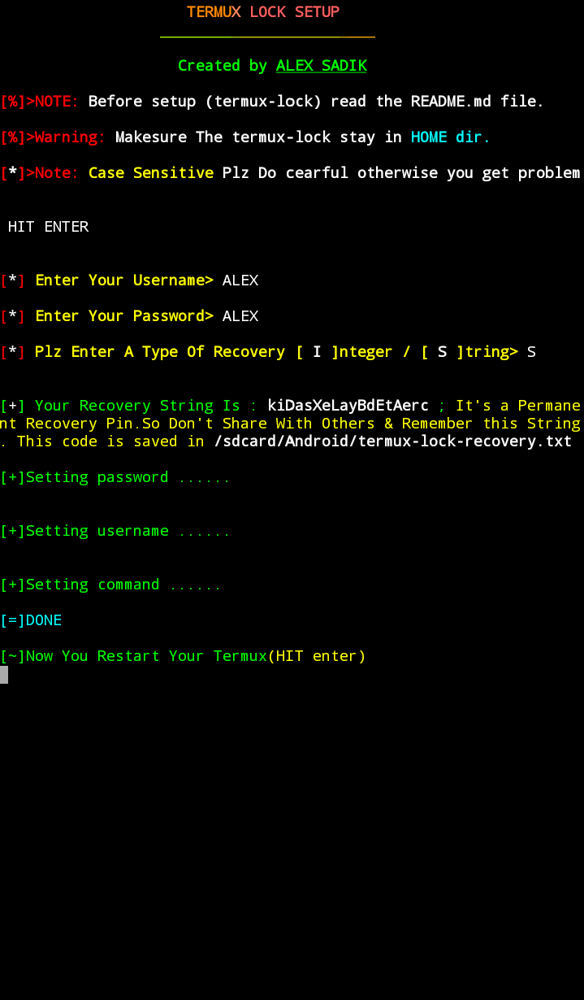

# Term-lock

 

Installation of this tool:

1] git clone https://github.com/haxzsadik/term-lock

2] cd termux-lock

3] chmod +x lock-setup.sh reset.sh

4] ./lock-setup.sh 

or if ./lock-setup.sh is not work then type 'bash lock-setup.sh'
